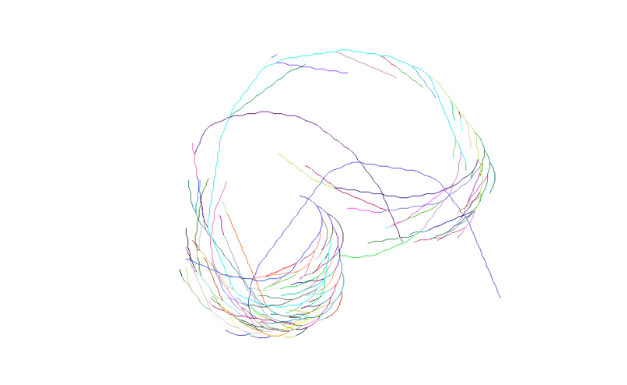

# Collats-Conjecture
Visualization of Collats Conjecture

A application to visualize [Collatz Conjecture](https://en.wikipedia.org/wiki/Collatz_conjecture) patterns.
The lines are drawn with [Bresenham's line algorithm](https://en.wikipedia.org/wiki/Bresenham%27s_line_algorithm) and a small [image library](https://danielbeard.wordpress.com/2011/06/06/image-saving-code-c/) by Daniel Beard is used to create a TGA file. 

Inspiered by this video [Collatz Conjecture in Color - Numberphile](https://www.youtube.com/watch?v=LqKpkdRRLZw).

